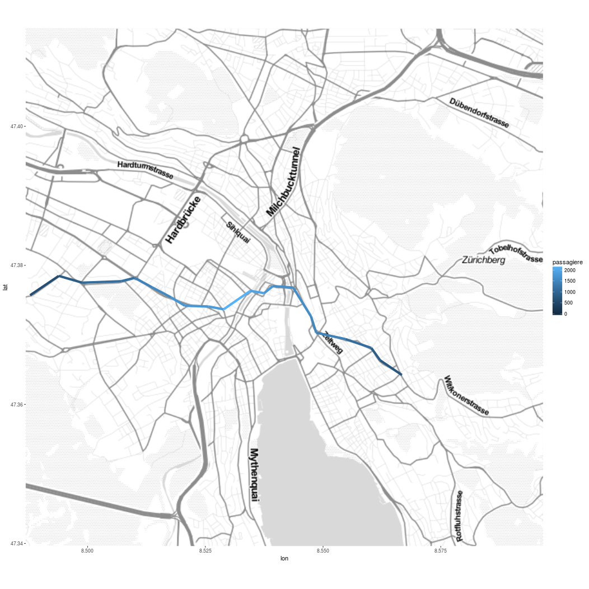

# Number of passengers on public transport in Zurich

This is example code for how to visualise the number of passengers on public transport in Zurich using data from the city's open data catalogue at [https://data.stadt-zuerich.ch/](https://data.stadt-zuerich.ch/).

